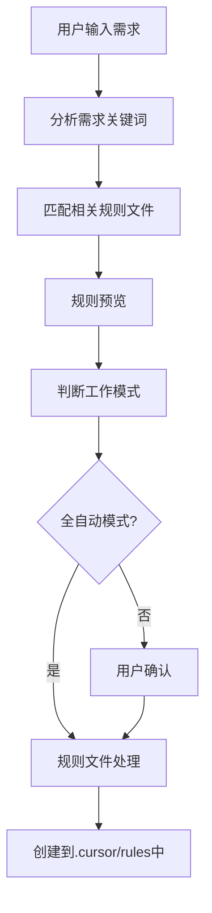

# MCP（模型上下文协议）服务器需求规格

## 项目概述
开发一个基于Node.js和TypeScript的MCP(model context protocol)服务器，用于智能识别用户需求并自动创建和管理项目规则文件。

## 功能需求
1. **用户输入处理**
   - 接收并解析用户的项目创建请求，例如："帮我创建一个Next.js+tailwind+shadcn/ui的项目"
   - 提取关键技术栈和框架信息

2. **规则识别与匹配**
   - 基于提取的关键词，在规则库中识别并匹配相关的rules文件
   - 支持多种技术栈组合的智能匹配（如React+Tailwind、Vue+Vite等）
   - 处理规则优先级和冲突情况

3. **规则预览**
   - 将匹配到的rules内容格式化后输出到对话中
   - 提供规则应用的预览说明

4. **规则创建**
   - 用户确认后，将对应规则创建到目标项目目录的`.cursor/rules`文件夹下
   - 支持规则文件的合并和自定义
   - 提供规则创建成功的反馈

## 工作模式
- **交互式模式**：输出规则预览，等待用户确认后创建
- **全自动模式**：根据置信度自动识别并创建规则，无需用户确认

## 流程图 

## 技术要求
1. **开发环境**
   - 使用Node.js和TypeScript进行开发
   - 遵循严格的类型规范和接口定义
   - 用这个依赖库 [@modelcontextprotocol/sdk](https://github.com/modelcontextprotocol/typescript-sdk)

2. **代码质量**
   - 实现完整的类型定义
   - 采用模块化设计，保证代码可维护性
   - 编写单元测试确保功能正确性

3. **性能考虑**
   - 优化规则匹配算法以提高响应速度
   - 合理处理并发请求

## 数据结构
1. **用户需求模型**：定义用户输入的解析结构
2. **规则文件模型**：定义规则文件的结构和元数据
3. **匹配结果模型**：定义规则匹配结果的数据结构

